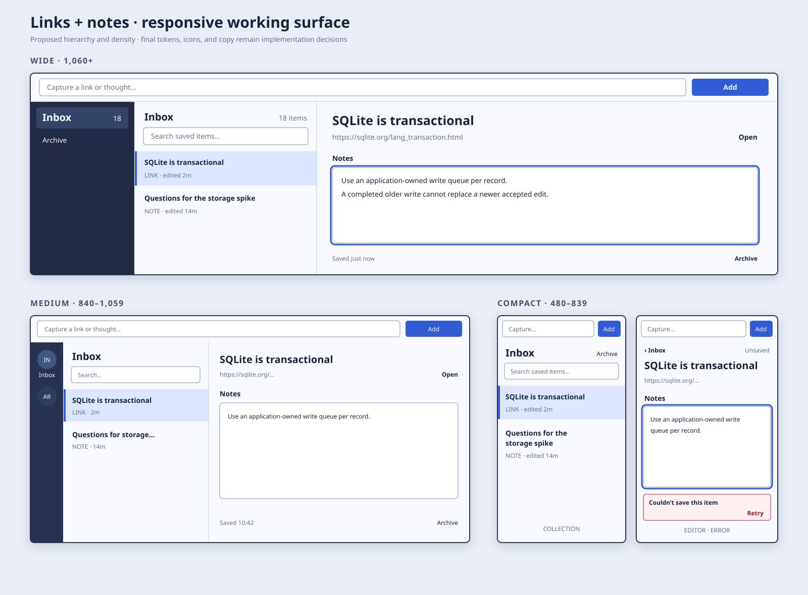

# Responsive design board

The [responsive design board](responsive-design-board.svg) is the inspectable visual reference for the wide, medium, compact collection, and compact editor arrangements. It demonstrates hierarchy, pane density, keyboard focus, saving, and save-error treatments. Final theme-token values, icon artwork, and pixel-level styling remain implementation decisions.

